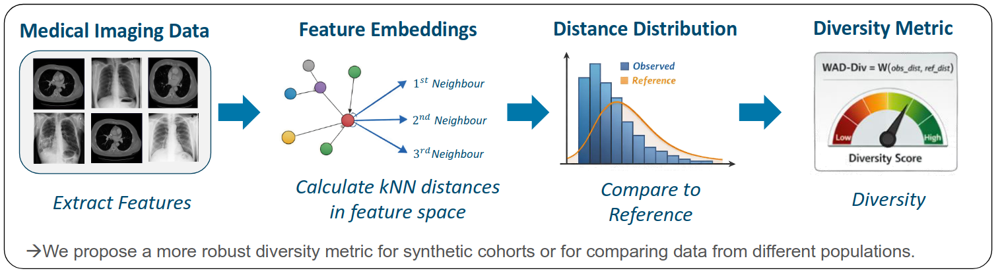

# WAD-Div: Wasserstein Distance Diversity

> A feature-space diversity metric for evaluating synthetic medical image datasets.



## Abstract

Generative models are increasingly used in medical imaging for tasks such as data augmentation, privacy-preserving sharing, and image translation. Beyond realism, it is crucial that generated images capture clinically relevant diversity, including variations in anatomy and pathology. Dataset diversity is often assessed using the Multi-Scale Structural Similarity Index (MS-SSIM), which operates in pixel space. However, we show that MS-SSIM is highly sensitive to small perturbations and quickly saturates, failing to capture intrinsic anatomical variability. To address this, we introduce Wasserstein distance diversity **WAD-Div**, a feature-space metric that computes k-nearest neighbor distance distributions and quantifies diversity via Wasserstein distances to a reference. Experiments on chest X-ray and lung CT datasets demonstrate that WAD-Div reliably reflects dataset diversity and distributional similarity, whereas MS-SSIM can be misleading under simple augmentations. WAD-Div provides a robust framework for evaluating medical image dataset diversity beyond pixel-level measures.

---

## Method

WAD-Div quantifies the diversity of a dataset in four steps:

1. **Extract features** from images using a pretrained feature extractor (e.g. MedicalNet, a vision encoder).
2. **Compute kNN distances** — for each sample, compute the distances to its *k* nearest neighbors in feature space.
3. **Build a distance distribution** from all kNN distances across the dataset.
4. **Measure Wasserstein distance** between the observed distribution and a reference distribution.


### Reference Distributions

| Reference | Description | Use case |
|---|---|---|
| `zero` | Dirac delta at 0 (complete collapse) | Absolute diversity, model-only evaluation |
| `exponential` | Fitted exponential baseline | Soft low-variability baseline |
| `empirical` | kNN distribution of a real dataset | Direct comparison to real data |

### Normalization

An optional normalized score $W_\text{norm} \in [0, 1)$ can be computed by anchoring to a maximally diverse reference dataset (typically the real training set):

$$W_\text{norm} = \text{clip}\!\left(\frac{W}{W_\text{max}}, 0, 1\right)$$

A score of `~1` indicates diversity comparable to the real dataset; `~0` indicates mode collapse.

---

## Installation

No package installation is required. Copy `waddiv.py` into your project and install the dependencies:

```bash
pip install numpy scipy
```

---

## Usage

See [`example_usage.ipynb`](example_usage.ipynb) for a full walkthrough including:

- Loading precomputed feature embeddings
- Computing WAD-Div with all three reference types (zero, exponential, empirical)
- Fitting a normalization anchor on a real dataset
- Understanding the role of the `k` parameter

---

## Citation

If you use WAD-Div in your research, please cite our paper:

```bibtex
@InProceedings{10.1007/978-3-658-51100-5_83,
author="Seyfarth, Marvin
and Dar, Salman U. H.
and Engelhardt, Sandy",
editor="Handels, Heinz
and Breininger, Katharina
and Deserno, Thomas
and Maier, Andreas
and Maier-Hein, Klaus
and Palm, Christoph
and Tolxdorff, Thomas",
title="Rethinking Diversity Metrics in Medical Imaging with Wasserstein Distance",
booktitle="Bildverarbeitung f{\"u}r die Medizin 2026",
year="2026",
publisher="Springer Fachmedien Wiesbaden",
address="Wiesbaden",
pages="420--426",
}
```

The example embeddings in this repository were extracted using [Med3D](https://github.com/Tencent/MedicalNet). If you use these embeddings or MedicalNet as your feature extractor, please also cite:

```bibtex
@article{chen2019med3d,
  title   = {Med3D: Transfer Learning for 3D Medical Image Analysis},
  author  = {Chen, Sihong and Ma, Kai and Zheng, Yefeng},
  journal = {arXiv preprint arXiv:1904.00625},
  year    = {2019},
}
```
